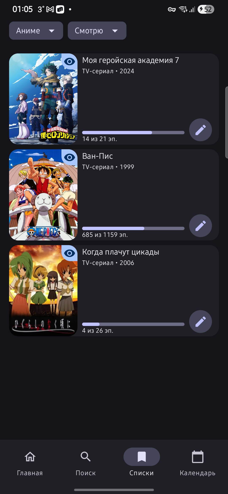
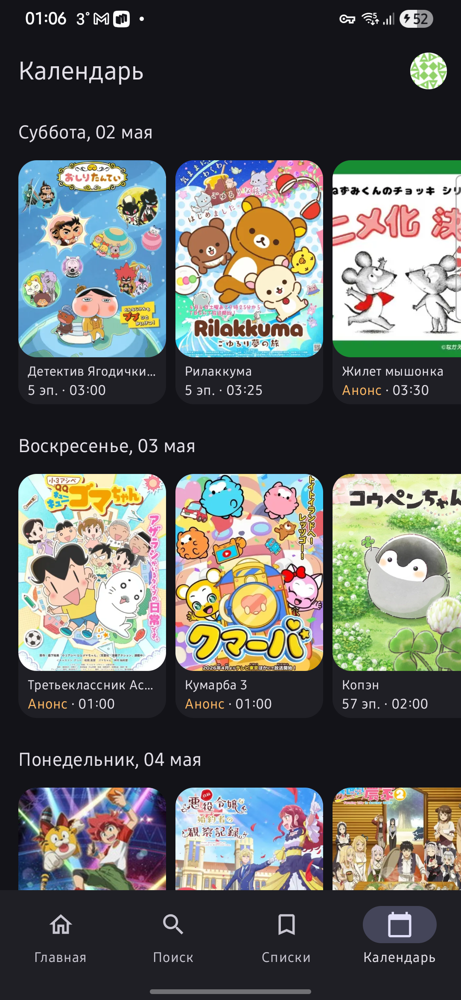

# Seanime

**Seanime** — Android-приложение для просмотра онлайн энциклопедии аниме и манги, работающее на базе API сайта [Shikimori](https://shikimori.one).

---

## 📸 Скриншоты

### Главная


### Поиск


### Детали произведения


### Пользовательский список


### Календарь выходов


---

## ✨ Возможности

- 🔍 **Поиск** аниме и манги
- 📋 **Личные списки** — управление списком просмотра/чтения
- 📅 **Календарь** — расписание выхода новых серий
- 🎭 **Персонажи** — информация о персонажах
- 🖼️ **Скриншоты и видео** — галерея материалов по тайтлу
- ⭐ **Оценки** — выставление и редактирование оценок

---

## 🛠️ Технический стек

| Область                    | Технология                          |
|----------------------------|-------------------------------------|
| Язык                       | Kotlin                              |
| UI                         | Jetpack Compose + Material 3        |
| Авторизация                | OAuth 2.0 (AppAuth)                 |
| Сетевой слой               | Retrofit / Apollo GraphQL  + OkHttp |
| DI                         | Hilt                                |
| БД                         | Room                                |
| Хранилище настроек         | DataStore (Protobuf)                |
| Изображения                | Coil                                |
| Навигация                  | Jetpack Navigation Compose          |
| Пагинация                  | Jetpack Paging 3                    |
| Минимальная версия Android | Android 8.0 (API 26)                |

---

## 🏗️ Архитектура

Проект построен по принципу **многомодульной архитектуры** и следует паттерну **Clean Architecture**:

```
Seanime/
├── app/                    # Точка входа, граф навигации
├── core/
│   ├── auth                # OAuth-сессия, AppAuth
│   ├── common              # Общие утилиты и интерфейсы
│   ├── data                # Репозитории, источники данных
│   ├── database            # Room база данных
│   ├── datastore           # DataStore
│   ├── datastore-proto     # Protobuf-схемы
│   ├── designsystem        # Дизайн-система, темы
│   ├── domain              # Use case'ы
│   ├── model               # Доменные модели
│   ├── navigation          # Навигационный контракт
│   ├── network             # REST-клиент (Retrofit)
│   ├── network-graphql     # GraphQL-клиент (Apollo)
│   ├── textprocessor       # Обработка текста
│   ├── ui / ui2            # Общие UI-компоненты
└── feature/
    ├── calendar            # Экран календаря
    ├── character           # Экран персонажа
    ├── home                # Главный экран
    ├── imageview           # Просмотр изображений
    ├── list                # Список тайтлов пользователя
    ├── profile             # Профиль пользователя
    ├── search              # Поиск
    ├── title/
    │   ├── authors         # Авторы тайтла
    │   ├── characters      # Персонажи тайтла
    │   ├── details         # Детали тайтла
    │   ├── related         # Связанные тайтлы
    │   ├── screenshots     # Скриншоты тайтла
    │   └── videos          # Видео тайтла
    └── userrate            # Управление оценкой
```

---

## 🚀 Запуск

### Предварительные требования

- Android Studio Hedgehog или выше
- JDK 17+
- Зарегистрированное приложение на [Shikimori](https://shikimori.one/oauth/applications)

### Настройка

1. Клонируйте репозиторий:
   ```bash
   git clone https://github.com/vladsaybulin/Seanime.git
   ```

2. Скопируйте файл секретов:
   ```bash
   cp secrets.properties secrets.properties.example
   ```

3. Заполните `secrets.properties` вашими данными от Shikimori OAuth:
   ```properties
   SHIKIMORI_CLIENT_ID=your_client_id
   SHIKIMORI_CLIENT_SECRET=your_client_secret
   ```

4. Соберите и запустите проект в Android Studio.

---

## 📄 Лицензия

```
Copyright 2026 Vlad Saybulin

Licensed under the Apache License, Version 2.0 (the "License");
you may not use this file except in compliance with the License.
You may obtain a copy of the License at

    http://www.apache.org/licenses/LICENSE-2.0

Unless required by applicable law or agreed to in writing, software
distributed under the License is distributed on an "AS IS" BASIS,
WITHOUT WARRANTIES OR CONDITIONS OF ANY KIND, either express or implied.
See the License for the specific language governing permissions and
limitations under the License.
```

****